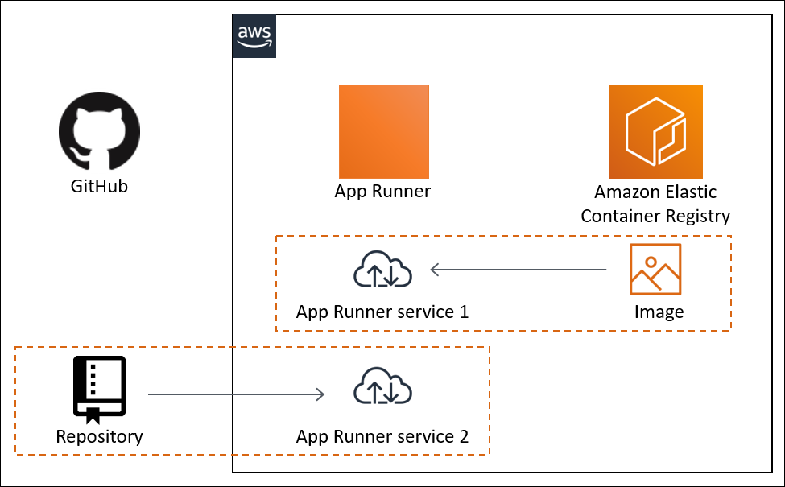

AWS DEPLOYMENT GUIDE | DEPLOY A WEB APP ON NGINX SERVER USING AWS APP RUNNER
==================================================
# Instructions

To deploy your web application on Nginx Server using AWS App Runner, follow these steps:


1. Create ECR repository
2. Create a container image for your web application.
3. Push the container image to Amazon Elastic Container Registry (ECR).
4. Create an AWS App Runner service to run your web application.

For detailed instructions, refer to the [AWS App Runner Getting Started Guide](https://aws.amazon.com/getting-started/guides/deploy-webapp-apprunner/?ref=gsrchandson).

## Arquicteture

## Architecture



## Using Makefile

If you have a Makefile in your project, you can use it to simplify the build and deployment process. Here's how you can use the Makefile:

### Note: Configure all the variables in the Makefile before running the commands.

1. Open a terminal or command prompt.
2. Navigate to the root directory of your project.
3. Run the following command to create ECR repository:

    ```bash
    make create_ecr
    ```

    This command will execute the create_ecr target defined in the Makefile and create an Amazon ECR repository for your container image.

4. Next, build the container image for your web application by running the following command:

    ```bash
    make docker_build
    ```

    This command will execute the docker_build target defined in the Makefile and build the container image using the Dockerfile in your project.

5. Finally, you can create an AWS App Runner service to run your web application by running the following command:

    ```bash
    make apply_tf
    ```

    This command will execute the plan_tf target defined in the Makefile and create an AWS App Runner service using Terraform.

6. Once the deployment is complete, you can access your web application using the URL provided by AWS App Runner.

7. Destroy the AWS App Runner service by running the following command:

    ```bash
    make destroy_tf
    ```

    This command will execute the destroy_tf target defined in the Makefile and delete the AWS App Runner service using Terraform.

Make sure to customize the Makefile according to your project's requirements and dependencies.
Check the makefile for more information.


