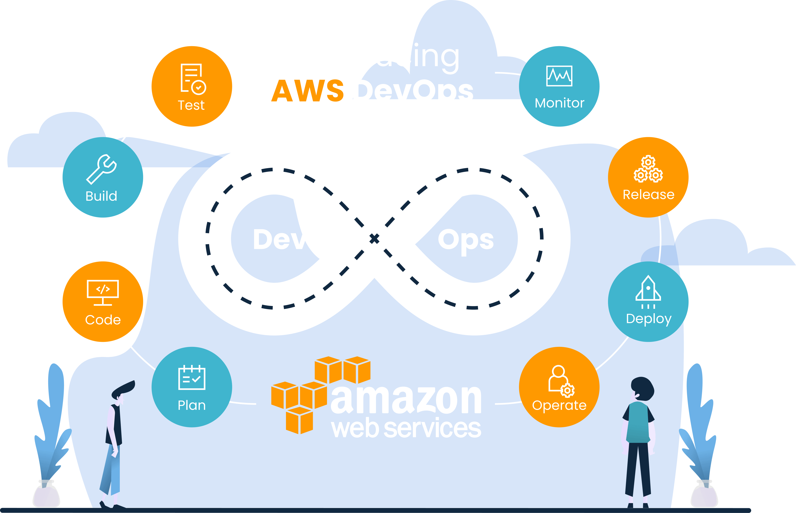

# AWS Projects

## AWs DevOps

Welcome to the AWS Projects repository! Here you will find a collection of projects designed to help you learn and explore AWS (Amazon Web Services). Whether you are a beginner or an experienced developer, these projects will provide hands-on experience and deepen your understanding of AWS services.

Start your journey into the world of AWS by exploring the project folders and following the step-by-step instructions provided in each project's README file. Each project is carefully crafted to cover different aspects of AWS, including compute, storage, networking, security, and more.

Get ready to dive into the exciting world of AWS and enhance your skills with these educational projects. Happy learning!
